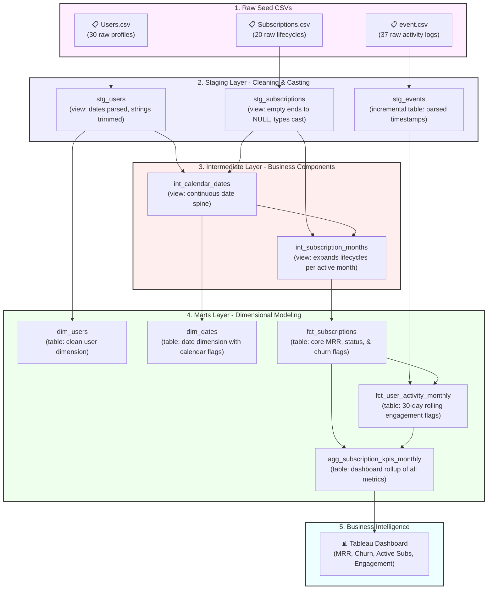

# 📊 SaaS Subscription & Usage Analytics (dbt + BigQuery)

A complete, production-grade analytics engineering foundation built with **dbt Core** and **GCP BigQuery**. This project transforms raw, messy SaaS database dumps into clean, tested, and reliable business dimensions and facts to power C-suite dashboards in **Tableau**.

---

## 📖 The Story: What Problem Are We Solving?

Imagine you work at a subscription-based SaaS company. The Finance, Growth, and Product teams all need to know key business metrics: **Monthly Recurring Revenue (MRR)**, **active subscriber counts**, **churn rates**, and **user engagement**. 

Currently, the company suffers from:
* **Inconsistent Definitions:** Finance calculates MRR one way; Growth calculates it another.
* **Messy Raw Data:** Date fields are formatted differently, and active subscriptions have empty strings instead of proper `NULL` values.
* **Dashboard Chaos:** Two different Tableau dashboards show conflicting churn rates.

### The Solution: A Single Source of Truth
This repository implements a **structured data warehouse pipeline** using dbt. It takes raw database exports, cleans them, applies standardized business rules, tests them for data quality, and outputs a single, trusted table that powers all dashboards.

---

## 🏗️ Data Architecture (The DAG)

dbt compiles your SQL files and automatically determines the order in which tables must build based on their dependencies (represented as a **Directed Acyclic Graph** or **DAG**):



---

## 📂 Understanding the Data Layers (For Beginners)

To keep the pipeline clean and maintainable, we separate our models into distinct directory layers:

| Layer | Analogy | Rules in dbt | Examples in this Project |
| :--- | :--- | :--- | :--- |
| **1. Seeds** | **Raw Ingredients:** Unprocessed CSV files loaded directly to the warehouse. | Never edit seeds directly. | [Users.csv](file:///e:/Data_Engg_Projects/DBT/dish_assignment/dish_assignment/seeds/Users.csv), [Subscriptions.csv](file:///e:/Data_Engg_Projects/DBT/dish_assignment/dish_assignment/seeds/Subscriptions.csv) |
| **2. Staging** | **Washing & Cutting:** Cleaning fields, casting data types, and trimming whitespace. | 1:1 with raw tables. Materialized as **Views** to save cost. Never join tables here. | [stg_users.sql](file:///e:/Data_Engg_Projects/DBT/dish_assignment/dish_assignment/models/staging/stg_users.sql), [stg_subscriptions.sql](file:///e:/Data_Engg_Projects/DBT/dish_assignment/dish_assignment/models/staging/stg_subscriptions.sql) |
| **3. Intermediate** | **Pre-cooking Components:** Preparing reusable complex logics (like date grids). | Never queried by BI tools. Materialized as **Views**. | [int_calendar_dates.sql](file:///e:/Data_Engg_Projects/DBT/dish_assignment/dish_assignment/models/intermediate/int_calendar_dates.sql), [int_subscription_months.sql](file:///e:/Data_Engg_Projects/DBT/dish_assignment/dish_assignment/models/intermediate/int_subscription_months.sql) |
| **4. Marts** | **The Finished Dish:** Standardized dimensions (`dim_`) and facts (`fct_`) ready for consumption. | Materialized as **Tables** in BigQuery for fast query speeds. | [fct_subscriptions.sql](file:///e:/Data_Engg_Projects/DBT/dish_assignment/dish_assignment/models/marts/fct_subscriptions.sql), [agg_subscription_kpis_monthly.sql](file:///e:/Data_Engg_Projects/DBT/dish_assignment/dish_assignment/models/marts/agg_subscription_kpis_monthly.sql) |

---

## ⚡ Advanced Implementations

This project implements industry-standard data warehouse patterns:

### 1. Incremental Materialization (Saves Query Cost)
Instead of rebuilding the entire event table from scratch every run, [stg_events.sql](file:///e:/Data_Engg_Projects/DBT/dish_assignment/dish_assignment/models/staging/stg_events.sql) is materialized as **`incremental`**.
* **First Run:** dbt pulls all events and creates a table.
* **Subsequent Runs:** dbt queries `MAX(event_timestamp)` currently in the table, selects only the *newest* events from the raw logs, and **merges** them.
* **Why it matters:** In production with billions of log rows, this cuts processing costs by 99%.

### 2. History Tracking Snapshots (SCD Type 2)
What happens if user 30 changes their subscription plan from `basic` to `pro`? The raw database overwrites the record, losing history.
* We created [snapshots/snp_users.sql](file:///e:/Data_Engg_Projects/DBT/dish_assignment/dish_assignment/snapshots/snp_users.sql) using the `check` strategy.
* On execution, dbt detects changes and maintains a historical trail:
  ```
  +---------+-----------+---------------------+---------------------+
  | user_id | plan_type |   dbt_valid_from    |    dbt_valid_to     |
  +---------+-----------+---------------------+---------------------+
  |      30 | basic     | 2026-05-27 19:59:18 | 2026-05-27 20:01:47 |
  |      30 | pro       | 2026-05-27 20:01:47 |                NULL |
  +---------+-----------+---------------------+---------------------+
  ```
* **Why it matters:** Essential for historical reporting (e.g. "What was our plan distribution in Q1?").

### 3. Automated Data Quality Testing
We run **29 tests** on every deployment to ensure data integrity:
* **Unique & Not Null:** Applied to all primary keys (`user_id`, `subscription_id`, `event_id`).
* **Accepted Values:** Verifies `plan_type` contains only `free`, `basic`, or `pro`.
* **Custom Singular Tests:**
  * [assert_monthly_revenue_non_negative.sql](file:///e:/Data_Engg_Projects/DBT/dish_assignment/dish_assignment/tests/assert_monthly_revenue_non_negative.sql): Fails if monthly subscription price is less than 0.
  * [assert_subscription_dates_valid.sql](file:///e:/Data_Engg_Projects/DBT/dish_assignment/dish_assignment/tests/assert_subscription_dates_valid.sql): Fails if `end_date` is earlier than `start_date`.

---

## 🚀 How to Run the Project Locally

### 1. Prerequisites
* Python installed on your computer.
* A GCP BigQuery project with a Service Account JSON key.

### 2. Setup Virtual Environment & Install dbt
```bash
# Create python virtual environment
python -m venv .venv

# Activate it (Windows)
.venv\Scripts\activate

# Install dbt-bigquery adapter
pip install dbt-bigquery
```

### 3. Install Packages
Downloads utility packages like `dbt-utils` declared in `packages.yml`:
```bash
dbt deps
```

### 4. Configure Connection
Create a [profiles.yml](file:///e:/Data_Engg_Projects/DBT/dish_assignment/dish_assignment/profiles.yml) in your project root pointing to your BigQuery key:
```yaml
dish_assignment:
  target: dev
  outputs:
    dev:
      type: bigquery
      method: service-account
      project: fx-project-shiva-26
      dataset: marts
      location: europe-west3
      threads: 4
      keyfile: E:\Data_Engg_Projects\Keys\fx-project-shiva-26-406b116a0688.json
```

Verify the connection:
```bash
dbt debug
```

---

## 🛠️ Essential dbt Commands

Execute these commands from your root folder:

```bash
# 1. Load CSVs into BigQuery (Creates raw_data.Users, raw_data.Subscriptions, etc.)
dbt seed

# 2. Compile and run all models to build views/tables
dbt run

# 3. Run all 29 data quality tests
dbt test

# 4. Do everything in one command (seed + run + test)
dbt build

# 5. Run historical snapshot updates
dbt snapshot

# 6. Generate and serve interactive documentation site
dbt docs generate
dbt docs serve
```

---

## 📊 Tableau Dashboard Connection

The Tableau dashboard connects directly to the BigQuery project.

Instead of writing complex SQL queries in Tableau (which slows down dashboards), Tableau points directly to:
👉 **`marts.agg_subscription_kpis_monthly`**

This table has pre-calculated monthly metrics:
* `month_start` (X-axis for timelines)
* `mrr` (Monthly Recurring Revenue trend line)
* `active_subscribers` (Total paying customer cards)
* `churn_rate` (Customer loss trend lines)
* `usage_proxy_pct` (Activity trend: percentage of active users who logged in or used features in the last 30 days)
